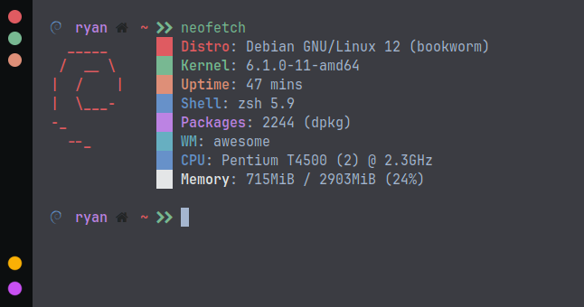
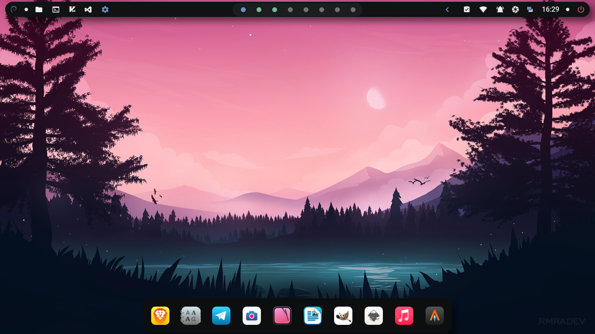
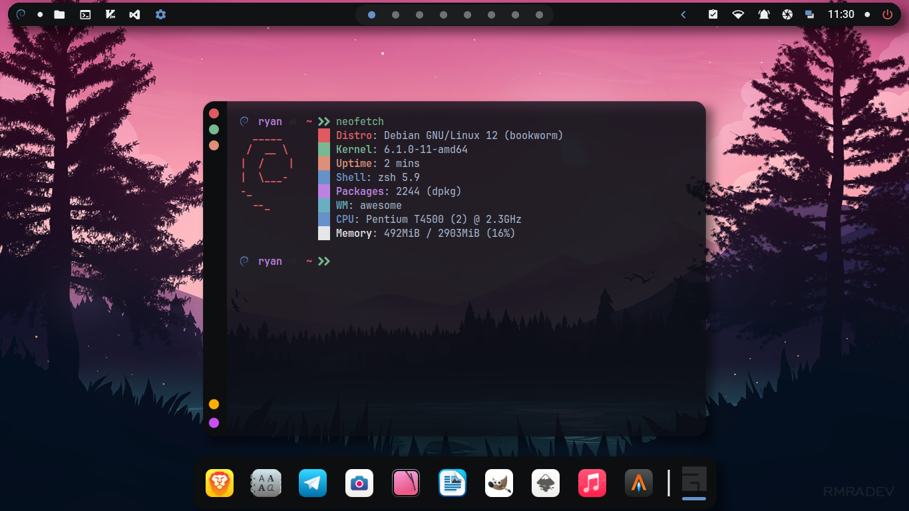
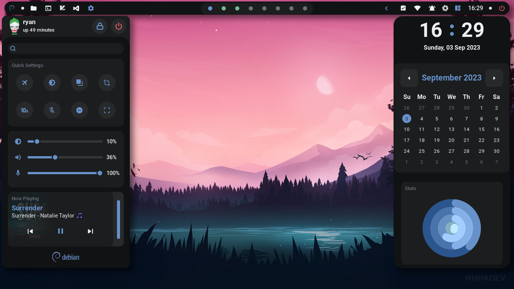
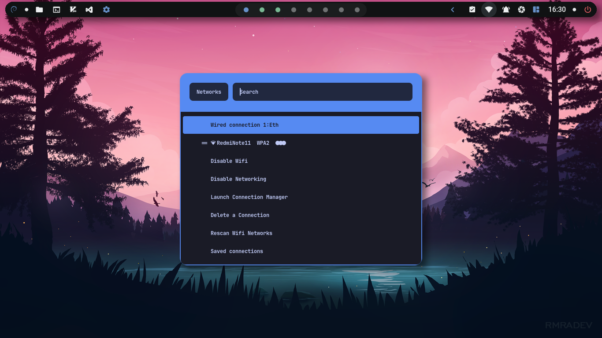
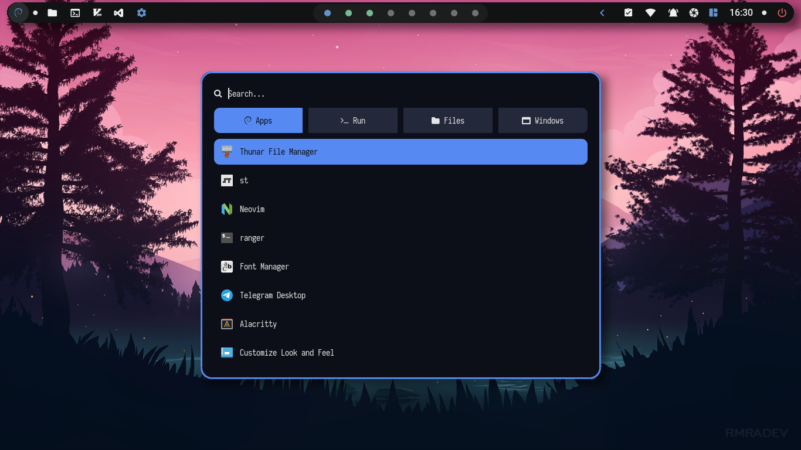
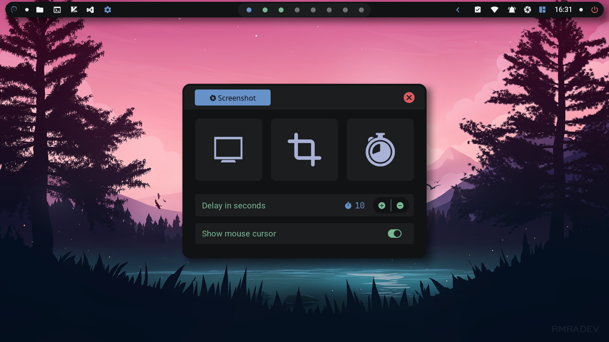

<div align=center>

<a href="https://awesomewm.org/"></a>

<div align="center">
    
    
</div>

</div>

## 🔥 Information



|    Distro    |                            [Debian 12](https://debian.org/)                            |
| :----------: | :------------------------------------------------------------------------------------: |
|      WM      |                   [AwesomeWM](https://github.com/awesomeWM/awesome)                    |
|   Terminal   | [Alacritty](https://github.com/alacritty/alacritty)-[St](https://github.com/siduck/st) |
|    Shell     |                    [Oh My Zsh](https://github.com/ohmyzsh/ohmyzsh)                     |
|   Launcher   |                       [Rofi](https://github.com/davatorium/rofi)                       |
|  Clipboard   |                  [Rofi-Greenclip](https://github.com/erebe/greenclip)                  |
|    Neovim    |     [Neovim](https://github.com/neovim/neovim)-[Astronvim](https://astronvim.com/)     |
|  Compositor  |                                         Picom                                          |
| Music/Player |                                      MPD-Ncmpcpp                                       |
| File Manager |                                         Thunar                                         |

<br>

## 🖵 Screenshoot













## 🍀 Setup

1.- <b>First clone the repository</b>

2.- <b>Copy config :</b>

- **⚠️ WARNING: Configuration files may be overrided,please backup your config**

```sh
cd dotfiles-awesomewm
cp -r config/* ~/.config/
cp -r local/* ~/.local/
cp -r home/* ~/
```

3.- <b>Install Dependencies</b>

- **Read Notice**

This dotfiles use awesome.git, so for Debian 12/Ubuntu you must read this, For Other distro like Archlinux and other no problem to install awesome.git

Dependencies :

```sh
awesome build-essential cmake make gcc lua5.2 liblua5.3-dev lua-busted lua-discount lua-ldoc lua-lgi lua5.3 asciidoctor debhelper-compat imagemagick libcairo2-dev libdbus-1-dev libgdk-pixbuf2.0-dev libglib2.0-dev libpango1.0-dev libstartup-notification0-dev libx11-xcb-dev libxcb-cursor-dev libxcb-icccm4-dev libxcb-keysyms1-dev libxcb-randr0-dev libxcb-shape0-dev libxcb-util0-dev libxcb-xinerama0-dev libxcb-xkb-dev libxcb-xrm-dev libxcb-xtest0-dev libxdg-basedir-dev libxkbcommon-dev libxkbcommon-x11-dev x11proto-core-dev build-essential dbus-x11 gir1.2-gtk-3.0 libxcb-icccm4-dev libxcb-util0-dev libxcb1-dev x11-apps x11-utils x11-xserver-utils xfonts-base xterm xvfb libxcb-xfixes0-dev
```

- **After install dependencies, install awesome.git from folder app support, it`s my build**

```sh
cd app\ support/
sudo dpkg -i awesome-4.3.0.0\~git1606-g0e5fc457-dirty-Linux.deb
sudo cp awesome.desktop /usr/share/xsessions/
sudo chmod +x /usr/share/xsessions/awesome.desktop
```

- **or build from [awesome.git](https://github.com/awesomeWM/awesome)**

**I`m use this for build:**

```sh
CMAKE_ARGS="-DLUA_EXECUTABLE=/usr/bin/lua5.3 -DLUA_LIBRARY=/usr/lib/x86_64-linux-gnu/liblua5.3.so -DLUA_INCLUDE_DIR=/usr/include/lua5.3" make
```

5.- **Other dependecies only works for **Debian 12**, and based distro, for other distro you can search same packages**

```sh
alacritty brightnessctl dunst rofi jq policykit-1-gnome playerctl mpd ncmpcpp geany mpc picom xdotool feh ueberzug maim pamixer libwebp-dev xdg-user-dirs webp-pixbuf-loader zsh zsh-autosuggestions zsh-syntax-highlighting thunar thunar-volman thunar-archive-plugin gvfs gvfs-backends engrampa dmenu xdo redshift xautolock fzf ytfzf yt-dlp gawk tumbler gpick neofetch xdg-utils python-is-python3 python3-gi gir1.2-nm-1.0 duf libglib2.0-bin btop ncdu bat exa wmctrl acpid xclip scrot acpi playerctl redshift mpdris2 libplayerctl-dev gir1.2-playerctl-2.0 mpv lxapperience bc
```

***

- **For Neovim**

Because Neovim in Debian 12 to old, you can install neovim from folder app support or build from [Neovim](https://github.com/neovim/neovim)

- **For Fonts**

Extract fonts.zip in ~/.local/share/fonts than run fc-cache -fv in terminal

****
**For Debian/Ubuntu you can build for this :**

- [I3lock-Color](https://github.com/Raymo111/i3lock-color)

- [Rofi-Greenclip](https://github.com/erebe/greenclip)

- [Networkmanager_dmenu](https://github.com/firecat53/networkmanager-dmenu)

**Themes and icons :**

- [Material-GTK-Themes](https://github.com/Fausto-Korpsvart/Material-GTK-Themes)

- [TokyoNight](https://github.com/ljmill/tokyo-night-icons)

- [Cutefish](https://github.com/cutefishos/icons)

**Run mpd**

```sh
systemctl --user enable mpd
```

<table align="center">
   <tr>
      <th align="center">
      </th>
   </tr>
   <tr>
      <td align="center">

    💻 Dotfiles Configured at 1360x768 with 96 DPI on 1 monitor

   </tr>
   </table>

## Credits

[adi1090x](https://github.com/adi1090x/widgets), [rxyhn](https://github.com/rxyhn/yoru), [saimoomedits](https://github.com/saimoomedits/dotfiles), [AlphaTechnolog](https://github.com/AlphaTechnolog), [Chick2D](https://github.com/Chick2D/neofetch-themes), [bakkeby](https://github.com/bakkeby/dmenu-flexipatch)
